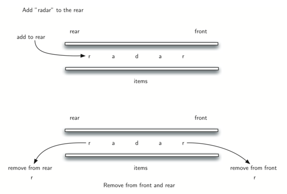

An interesting problem that can be easily solved using the deque data
structure is the classic palindrome problem. A **palindrome** is a
string that reads the same forward and backward, for example, *radar*,
*toot*, and *madam*. We would like to construct an algorithm to input a
string of characters and check whether it is a palindrome.

The solution to this problem will use a deque to store the characters of
the string. We will process the string from left to right and add each
character to the rear of the deque. At this point, the deque will be
acting very much like an ordinary queue. However, we can now make use of
the dual functionality of the deque. The front of the deque will hold
the first character of the string and the rear of the deque will hold
the last character.



Since we can remove both of them directly, we can compare them and
continue only if they match. If we can keep matching first and the last
items, we will eventually either run out of characters or be left with a
deque of size 1 depending on whether the length of the original string
was even or odd. In either case, the string must be a palindrome. A complete implementation for this strategy may look like:

```python
from collections import deque

def is_palindrome(characters):
    character_deque = deque(characters)

    while len(character_deque) > 1:
        first = character_deque.popleft()
        last = character_deque.pop()
        if first != last:
            return False

    return True

is_palindrome('lsdkjfskf')   # => False
is_palindrome('radar')   # => True
```

