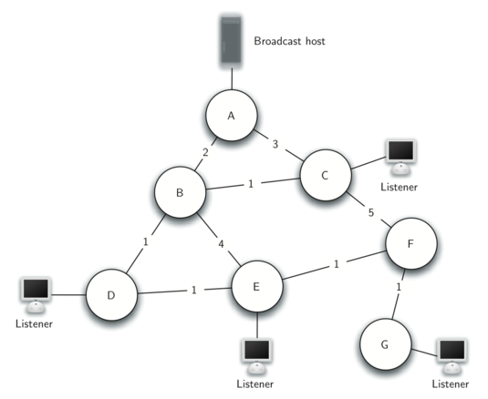
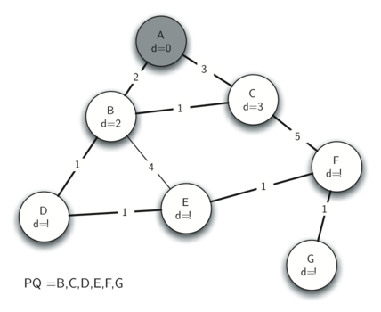
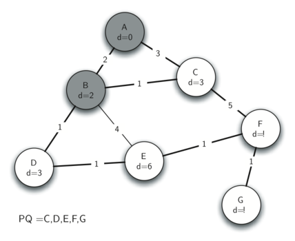
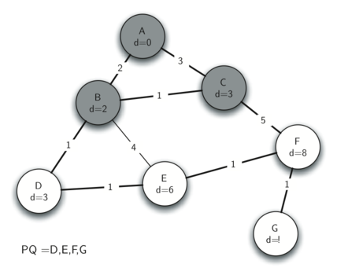
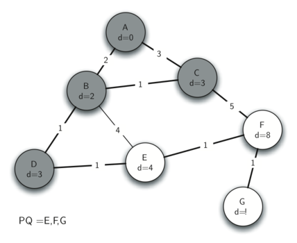
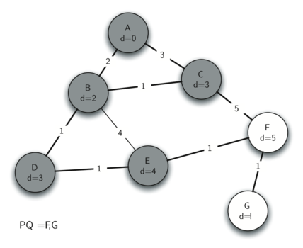
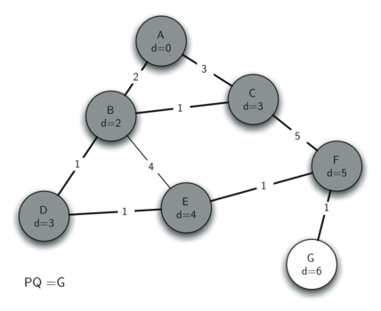
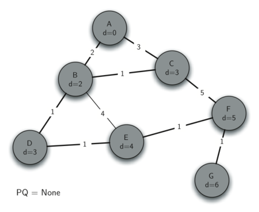

For our last graph algorithm let’s consider a problem that online game
designers and Internet radio providers face. The problem is that they
want to efficiently transfer a piece of information to anyone and
everyone who may be listening. This is important in gaming so that all
the players know the very latest position of every other player. This is
important for Internet radio so that all the listeners that are tuned in
are getting all the data they need to reconstruct the song they are
listening to. This diagram illustrates the broadcast
problem:

There are some brute force solutions to this problem, so let’s look at
them first to help understand the broadcast problem better. This will
also help you appreciate the solution that we will propose when we are
done. To begin, the broadcast host has some information that the
listeners all need to receive. The simplest solution is for the
broadcasting host to keep a list of all of the listeners and send
individual messages to each. In the diagram above we show a small
network with a broadcaster and some listeners. Using this first
approach, four copies of every message would be sent. Assuming that the
least cost path is used, let’s see how many times each router would
handle the same message.

All messages from the broadcaster go through router A, so A sees all
four copies of every message. Router C sees only one copy of each
message for its listener. However, routers B and D would see three
copies of every message since routers B and D are on the cheapest path
for listeners 1, 2, and 3. When you consider that the broadcast host
must send hundreds of messages each second for a radio broadcast, that
is a lot of extra traffic.

A brute force solution is for the broadcast host to send a single copy
of the broadcast message and let the routers sort things out. In this
case, the easiest solution is a strategy called **uncontrolled
flooding**. The flooding strategy works as follows. Each message starts
with a time to live (`ttl`) value set to some number greater than or
equal to the number of edges between the broadcast host and its most
distant listener. Each router gets a copy of the message and passes the
message on to *all* of its neighboring routers. When the message is
passed on the `ttl` is decreased. Each router continues to send copies
of the message to all its neighbors until the `ttl` value reaches 0. It
is easy to convince yourself that uncontrolled flooding generates many
more unnecessary messages than our first strategy.

The solution to this problem lies in the construction of a minimum
weight **spanning tree**. Formally we define the minimum spanning tree
$$T$$ for a graph $$G = (V,E)$$ as follows. $$T$$ is an acyclic subset
of $$E$$ that connects all the vertices in $$V$$. The sum of the weights
of the edges in T is minimized.

The diagram below shows a simplified version of the broadcast graph and
highlights the edges that form a minimum spanning tree for the graph.
Now to solve our broadcast problem, the broadcast host simply sends a
single copy of the broadcast message into the network. Each router
forwards the message to any neighbor that is part of the spanning tree,
excluding the neighbor that just sent it the message. In this example A
forwards the message to B. B forwards the message to D and C. D forwards
the message to E, which forwards it to F, which forwards it to G. No
router sees more than one copy of any message, and all the listeners
that are interested see a copy of the message.

The algorithm we will use to solve this problem is called Prim’s
algorithm. Prim’s algorithm belongs to a family of algorithms called the
“greedy algorithms” because at each step we will choose the cheapest
next step. In this case the cheapest next step is to follow the edge
with the lowest weight. Our last step is to develop Prim’s algorithm.

The basic idea in constructing a spanning tree is as follows:

    While T is not yet a spanning tree
       Find an edge that is safe to add to the tree
       Add the new edge to T

The trick is in the step that directs us to “find an edge that is safe.”
We define a safe edge as any edge that connects a vertex that is in the
spanning tree to a vertex that is not in the spanning tree. This ensures
that the tree will always remain a tree and therefore have no cycles.

The Python code to implement Prim’s algorithm is shown below. Prim’s
algorithm is similar to Dijkstra’s algorithm in that they both use a
priority queue to select the next vertex to add to the growing graph.

<!-- litpy graphs/prims_spanning_tree.py -->

The following sequence of diagrams shows the algorithm in operation on our
sample tree. We begin with the starting vertex as A. Looking at the neighbors
of A we can update distances to two of the additional vertices B and C because
the distances to B and C through A are less than infinite. We can then add B
and C to the priority queue in the correct order. Update the predecessor links
for B and C by setting them to point to A. It is important to note that we
have not formally added B or C to the spanning tree yet. A node is not
considered to be part of the spanning tree until it is removed from the
priority queue.

Since B has the smallest distance we look at B next. Examining B’s
neighbors we see that D and E can be updated. Both D and E get new
distance values and their predecessor links are updated. Moving on to
the next node in the priority queue we find C. The only node C is
adjacent to that is still in the priority queue is F, thus we can update
the distance to F and adjust F’s position in the priority queue.

Now we examine the vertices adjacent to node D. We find that we can
update E and reduce the distance to E from 6 to 4. When we do this we
change the predecessor link on E to point back to D, thus preparing it
to be grafted into the spanning tree but in a different location. The
rest of the algorithm proceeds as you would expect, adding each new node
to the tree.

