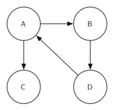
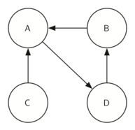
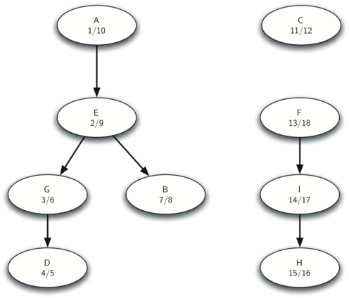

The World Wide Web, invented by Tim Berners-Lee in 1989, forms an extremely
large graph with web pages as vertices and hyperlinks as directed edges. As
you may realize as a reader of this “book”, the Web became the killer app
of the Internet, which was [invented by many people](http://smile.amazon.com/Dream-Machine-Licklider-Revolution-Computing/dp/0670899763/)
in the 60’s and 70’s and can itself be thought of as an extremely large
graph, with hosts as vertices and communication links as edges.

We will save the Internet for the next chapter; in this chapter, we’ll explore
the graph of web pages formed starting at this chapter!

Starting at a vertex representing this very web page, let’s draw directed
edges out to every web page that we’ve linked to. Then, from each of those
pages, let’s again identify the hyperlinks, and use those as directed edges to
another set of vertices. Doing this three links deep, we end up with a graph
that looks like the one below. Slide the slider to show the graphs at greater
and lesser depths.

[GRAPH]

If you look closely at the graph above you might make some interesting
observations.

You will probably notice that there is a tight clump of mutually connected
vertices formed by the web pages constituting the sections of this book. This
is because each has a table of contents, which links to each of the others.

Next you might notice that there are some other distinct clusters. For
instance, in the first paragraph of this page we link to an excellent computer
history book called _The Dream Machine_. And _in this very sentence_ we link
to another excellent computer history book, _[Dealers of
Lightning](http://smile.amazon.com/Dealers-Lightning-Xerox-PARC-Computer/dp/0887309895/)_.
In the graph above, these two vertices are connected, and in fact connect out
to a subgraph of other computer history books with a high density of mutual
links.

These observations show that there is some underlying structure to the web
that clusters together web sites that are similar on some level.

Let’s explore this connectedness by applying a definition: a **strongly
connected component** of a graph is a subset of vertices where there are paths
to and from any pair of vertices in the subset, but where adding any other
vertex would preclude this property.

Below, we have applied this definition in order to highlight the strongly
connected components of the graph above. We were able to do this using an
algorithm we’ll describe shortly. If you suspect that we just pre-colored the
vertices rather than using an algorithm, we encourage you to enter a url of
your own choosing to see the strongly connected components of the graph formed
from _that_ starting point.

[GRAPH]

Once again our algorithm relies on depth first search.

Once again we will see that we can create a very powerful and efficient
algorithm by making use of a depth first search. Before we tackle the main SCC
algorithm we must look at one other definition. The transpose of a graph $$G$$
is defined as the graph $$G^T$$ where all the edges in the graph have been
reversed. That is, if there is a directed edge from node A to node B in the
original graph then $$G^T$$ will contain and edge from node B to node A. The
animation below shows a simple graph and its transpose.

Notice that the graphs above have the same two strongly connected
components.

We can now describe the algorithm to compute the strongly connected
components for a graph.

1.  Perform a depth first search for the graph $$G$$ to compute the
    finish times for each vertex.
2.  Compute $$G^T$$.
3.  Perform a depth first search for the graph $$G^T$$ but in the main
    loop explore each vertex in decreasing order of finish time.
4.  Each tree in the forest computed in step 3 is a strongly
    connected component. Output the vertex ids for each vertex in each
    tree in the forest to identify the component.

Let’s trace the operation of the steps described above on an example
graph above with three strongly connected components:

Here are the start and finish times computed for the original graph:

Here are the starting and finishing times computed by on the transposed graph.

Finally, the illustration below shows the forest of three trees produced in
step 3 of the strongly connected component algorithm. You will notice that we
do not provide you with the Python code for the SCC algorithm, we leave
writing this program as an exercise.

