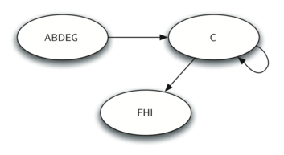
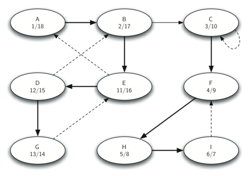
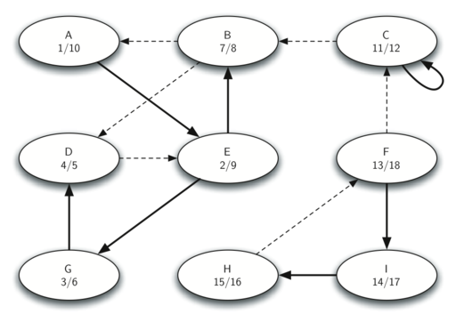

For the remainder of this section we will turn our attention to some
extremely large graphs. The graphs we will use to study some additional
algorithms are the graphs produced by the connections between hosts on
the Internet and the links between web pages. We will begin with web
pages.

Search engines like Google and Bing exploit the fact that the pages on
the web form a very large directed graph. To transform the World Wide
Web into a graph, we will treat a page as a vertex, and the hyperlinks
on the page as edges connecting one vertex to another. The illustration
below shows a very small part of the graph produced by following the
links from one page to the next, beginning at Luther College’s Computer
Science home page. Of course, this graph could be huge, so we have
limited it to web sites that are no more than 10 links away from the CS
home page.

If you study the graph above you might make some interesting
observations. First you might notice that many of the other web sites on
the graph are other Luther College web sites. Second, you might notice
that there are several links to other colleges in Iowa. Third, you might
notice that there are several links to other liberal arts colleges. You
might conclude from this that there is some underlying structure to the
web that clusters together web sites that are similar on some level.

One graph algorithm that can help find clusters of highly interconnected
vertices in a graph is called the strongly connected components
algorithm (**SCC**). We formally define a **strongly connected
component**, $$C$$, of a graph $$G$$, as the largest subset of vertices
$$C \subset V$$ such that for every pair of vertices $$v, w \in C$$ we have
a path from $$v$$ to $$w$$ and a path from $$w$$ to $$v$$.
The illustration below shows a simple graph with three strongly
connected components. The strongly connected components are identified
by the different shaded areas.

Once the strongly connected components have been identified we can show
a simplified view of the graph by combining all the vertices in one
strongly connected component into a single larger vertex. The simplified
version of the graph above is shown below.

Once again we will see that we can create a very powerful and efficient
algorithm by making use of a depth first search. Before we tackle the
main SCC algorithm we must look at one other definition. The transpose
of a graph $$G$$ is defined as the graph $$G^T$$ where all the edges in
the graph have been reversed. That is, if there is a directed edge from
node A to node B in the original graph then $$G^T$$ will contain and
edge from node B to node A. The diagrams below show a simple graph and
its transposition.

Notice that the graphs above have the same two strongly connected
components.

We can now describe the algorithm to compute the strongly connected
components for a graph.

1.  Perform a depth first search for the graph $$G$$ to compute the
    finish times for each vertex.
2.  Compute $$G^T$$.
3.  Perform a depth first search for the graph $$G^T$$ but in the main
    loop explore each vertex in decreasing order of finish time.
4.  Each tree in the forest computed in step 3 is a strongly
    connected component. Output the vertex ids for each vertex in each
    tree in the forest to identify the component.

Let’s trace the operation of the steps described above on the example
graph above with the three strongly connected components. Here are the
start and finish times computed for the original graph:

Here are the starting and finishing times computed by on the transposed graph.

Finally, the illustration below shows the forest of three
trees produced in step 3 of the strongly connected component algorithm.
You will notice that we do not provide you with the Python code for the
SCC algorithm, we leave writing this program as an exercise.

