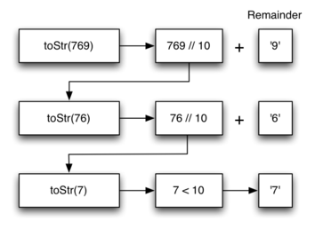

Suppose you want to convert an integer to a string in some base between
binary and hexadecimal. For example, convert the integer 10 to its
string representation in decimal as `'10'`, or to its string
representation in binary as `'1010'`. While there are many algorithms to
solve this problem, including the algorithm discussed in the stack
section, the recursive formulation of the problem is very elegant.

Let’s look at a concrete example using base 10 and the number 769.
Suppose we have a sequence of characters corresponding to the first 10
digits, like `CHAR_FOR_INT = '0123456789'`. It is easy to convert a number
less than 10 to its string equivalent by looking it up in the sequence.
For example, if the number is 9, then the string is `CHAR_FOR_INT[9]` or
`'9'`. If we can arrange to break up the number 769 into three
single-digit numbers, 7, 6, and 9, then converting it to a string is
simple. A number less than 10 sounds like a good base case.

Knowing what our base is suggests that the overall algorithm will
involve three components:

1.  Reduce the original number to a series of single-digit numbers.
2.  Convert the single digit-number to a string using a lookup.
3.  Concatenate the single-digit strings together to form the
    final result.

The next step is to figure out how to change state and make progress
toward the base case. Since we are working with an integer, let’s
consider what mathematical operations might reduce a number. The most
likely candidates are division and subtraction. While subtraction might
work, it is unclear what we should subtract from what. Integer division
with remainders gives us a clear direction. Let’s look at what happens
if we divide a number by the base we are trying to convert to.

Using integer division to divide 769 by 10, we get 76 with a remainder
of 9. This gives us two good results. First, the remainder is a number
less than our base that can be converted to a string immediately by
lookup. Second, we get a number that is smaller than our original and
moves us toward the base case of having a single number less than our
base. Now our job is to convert 76 to its string representation. Again
we will use integer division plus remainder to get results of 7 and 6
respectively. Finally, we have reduced the problem to converting 7,
which we can do easily since it satisfies the base case condition of
$$n < base$$, where $$base = 10$$. The series of operations we have just
performed is illustrated below. Notice that the
numbers we want to remember are in the remainder boxes along the right
side of the diagram.




Below is a Python implementation of this algorithm for any base between 2 and 16.

```python
CHAR_FOR_INT = '0123456789ABCDEF'

def to_string(n, base):
    if n < base:
        return CHAR_FOR_INT[n]

    return to_string(n // base, base) + CHAR_FOR_INT[n % base]

to_string(1453, 16)  # => 5AD
```

Notice that we check for the base case where `n` is less than
the base we are converting to. When we detect the base case, we stop
recursing and simply return the string from the `CHAR_FOR_INT`
sequence. Subsequently we satisfy both the second and third laws–by making
the recursive call and by reducing the problem size–using division.

Let’s trace the algorithm again; this time we will convert the number 10
to its base 2 string representation (`'1010'`).

The diagram below shows that we get the results we are
looking for, but it looks like the digits are in the wrong order.


The
algorithm works correctly because we make the recursive call first, then we add the string representation of the remainder. If we
reversed returning the `CHAR_FOR_INT` lookup and returning the `to_string`
call, the resulting string would be backward! But by delaying the
concatenation operation until after the recursive call has returned, we
get the result in the proper order. This should remind you of our
discussion of stacks back in the previous section.
