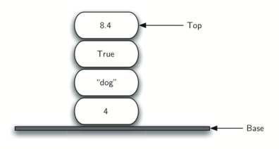

Stacks, queues, deques, and lists are data collections with items ordered according to how they are added or removed. Once an item is added, it stays in the same position relative to its neighbors. Because of this characteristic, we call these collections *linear data structures*.

Linear structures have two ends, referred to variously as “left” and “right”, “top” and “bottom”, or “front” and “rear”. What distinguishes one linear structure from another is where additions and removals may occur. For example, a structure might only allow new items to be added at one end and removed at another; another may allow addition or removal from either end.

These variations produce some of the most useful data structures in computer science. They appear in many algorithms and can be used to solve a variety of important problems.

Stacks
---

A *stack* is an ordered collection of items where the addition of new items and the removal of existing items always takes place at the same end. This end is commonly referred to as the “top”, and the opposite end is known as the “base”.

Items closer to the base have been in the stack the longest. The most recently added item is always on top and thus will be removed first. The stack provides an ordering based on length of time in the collection; the “age” of any given item increases as you move from top to base.

There are many examples of stacks in everyday situations. Consider a stack of plates, where it’s only possible to add or remove plates at the top. Or imagine a stack of books: the only book whose cover is visible is the one on top. To access the others, we must first remove the ones sitting on top of them.

Here’s another stack containing a number of primitive Python data objects:

One of the most useful features of stacks comes from the observation that the insertion order is the reverse of the removal order.

Starting with an empty desk, place books on top of each other one at a time. Then, consider what happens when you begin removing books: the order in which they’re removed is the reverse of the order in which they were placed. This ability to reverse the order of items is what makes stacks so important.

Below, we show the Python object stack during insertion and removal. Note the objects’ order.

Considering this reversal property, perhaps you can think of stack examples that occur while using your computer. For example, every web browser has a “Back” button. As you navigate from page to page, the URLs of those pages are placed on a stack. The page you’re currently viewing is on the top, and the first page you looked at is at the base. Clicking on the Back button moves you in reverse order through the stack of pages.

The Stack Abstract Data Type
---

An *abstract data type*, sometimes abbreviated *ADT*, is a logical description of how we view the data and the allowed operations without explaining how they’ll be implemented. This means that we’re only concerned with what the data represents instead of how it will be constructed. This level of abstraction *encapsulates* the data and hides implementation details from the user's view, a technique called *information hiding*.

A *data structure* is an implementation of an abstract data type and requires a physical view of the data using some collection of primitive data types and other programming constructs.

The separation of these two perspectives allows us to define complex data models for our problems without giving any details about how the model will actually be built. This provides an *implementation-independent* view of the data. Since there are usually many ways to implement an abstract data type, this independence allows the programmer to change implementation details without changing how the user interacts with it. Instead, the user can remain focused on the process of problem-solving.

The stack abstract data type is an ordered collection of items where items are added to and removed from the top. The interface for a stack is:

-   `Stack()` creates a new, empty stack
-   `push(item)` adds the given item to the top of the stack and returns nothing
-   `pop()` removes and returns the top item from the stack
-   `peek()` returns the top item from the stack but doesn’t remove it
-   `is_empty()` returns a boolean representing whether the stack is empty
-   `size()` returns an integer representing the number of items on the stack

For example, if `s` is a new stack, then the table below shows the results of a sequence of stack operations. The top item is the one farthest to the right in the “Stack contents” column.

Stack operation | Stack contents | Return value
--- | --- | ---
`s.is_empty()` | `[]` | `True`
`s.push(4)` | `[4]` |
`s.push('dog')` | `[4, 'dog']` |
`s.peek()` | `[4, 'dog']` | `'dog'`
`s.push(True)` | `[4, 'dog', True]` |
`s.size()` | `[4, 'dog', True]` | `3`
`s.is_empty()` | `[4, 'dog', True]` | `False`
`s.push(8.4)` | `[4, 'dog', True, 8.4]` |
`s.pop()` | `[4, 'dog', True]` | `8.4`
`s.pop()` | `[4, 'dog']` | `True`
`s.size()` | `[4, 'dog']` | `2`
