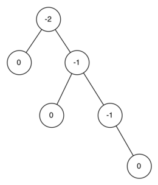
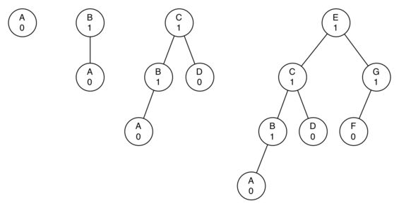

In the previous section we looked at building a binary search tree. As
we learned, the performance of the binary search tree can degrade to
$$O(n)$$ for operations like `get` and `put` when the tree becomes
unbalanced. In this section we will look at a special kind of binary
search tree that automatically makes sure that the tree remains balanced
at all times. This tree is called an **AVL tree** after its
inventors: G.M. Adelson-Velskii and E.M. Landis.

An AVL tree implements the Map abstract data type just like a regular
binary search tree, the only difference is in how the tree performs. To
implement our AVL tree we need to keep track of a **balance factor** for
each node in the tree. We do this by looking at the heights of the left
and right subtrees for each node. More formally, we define the balance
factor for a node as the difference between the height of the left
subtree and the height of the right subtree.

$$balanceFactor = height(leftSubTree) - height(rightSubTree)$$

Using the definition for balance factor given above we say that a
subtree is left-heavy if the balance factor is greater than zero. If the
balance factor is less than zero then the subtree is right heavy. If the
balance factor is zero then the tree is perfectly in balance. For
purposes of implementing an AVL tree, and gaining the benefit of having
a balanced tree we will define a tree to be in balance if the balance
factor is -1, 0, or 1. Once the balance factor of a node in a tree is
outside this range we will need to have a procedure to bring the tree
back into balance. The illustration below shows an example of an
unbalanced, right-heavy tree and the balance factors of each node.

Before we proceed any further let’s look at the result of enforcing this
new balance factor requirement. Our claim is that by ensuring that a
tree always has a balance factor of -1, 0, or 1 we can get better big O
performance of key operations. Let us start by thinking about how this
balance condition changes the worst-case tree. There are two
possibilities to consider, a left-heavy tree and a right heavy tree. If
we consider trees of heights 0, 1, 2, and 3,
The diagram below illustrates the most unbalanced
left-heavy tree possible under the new rules.

Looking at the total number of nodes in the tree we see that for a tree
of height 0 there is 1 node, for a tree of height 1 there is $$1+1
= 2$$ nodes, for a tree of height 2 there are $$1+1+2 = 4$$ and for a tree
of height 3 there are $$1 + 2 + 4 = 7$$. More generally the pattern we see
for the number of nodes in a tree of height h ($$N_h$$) is:

$$N_h = 1 + N_{h-1} + N_{h-2}$$

This recurrence may look familiar to you because it is very similar to
the Fibonacci sequence. We can use this fact to derive a formula for the
height of an AVL tree given the number of nodes in the tree. Recall that
for the Fibonacci sequence the $$i_{th}$$ Fibonacci number is given by:

$$F_0 = 0$$

$$F_1 = 1$$

$$F_i = F_{i-1} + F_{i-2}  \text{ for all } i \ge 2$$

An important mathematical result is that as the numbers of the Fibonacci
sequence get larger and larger the ratio of $$F_i / F_{i-1}$$ becomes
closer and closer to approximating the golden ratio $$\Phi$$ which is
defined as $$\Phi = \frac{1 + \sqrt{5}}{2}$$. You can consult a math text
if you want to see a derivation of the previous equation. We will simply
use this equation to approximate $$F_i$$ as $$F_i =
\Phi^i/\sqrt{5}$$. If we make use of this approximation we can rewrite
the equation for $$N_h$$ as:

$$N_h = F_{h+2} - 1, h \ge 1$$

By replacing the Fibonacci reference with its golden ratio approximation
we get:

$$N_h = \frac{\Phi^{h+2}}{\sqrt{5}} - 1$$

If we rearrange the terms, and take the base 2 log of both sides and
then solve for $$h$$ we get the following derivation:

$$\log{N_h+1} = (H+2)\log{\Phi} - \frac{1}{2} \log{5}$$

$$h = \frac{\log{N_h+1} - 2 \log{\Phi} + \frac{1}{2} \log{5}}{\log{\Phi}}$$

$$h = 1.44 \log{N_h}$$

This derivation shows us that at any time the height of our AVL tree is
equal to a constant(1.44) times the log of the number of nodes in the
tree. This is great news for searching our AVL tree because it limits
the search to $$O(\log{N})$$.

Implementation
---

Now that we have demonstrated that keeping an AVL tree in balance is
going to be a big performance improvement, let us look at how we will
augment the procedure to insert a new key into the tree. Since all new
keys are inserted into the tree as leaf nodes and we know that the
balance factor for a new leaf is zero, there are no new requirements for
the node that was just inserted. But once the new leaf is added we must
update the balance factor of its parent. How this new leaf affects the
parent’s balance factor depends on whether the leaf node is a left child
or a right child. If the new node is a right child the balance factor of
the parent will be reduced by one. If the new node is a left child then
the balance factor of the parent will be increased by one. This relation
can be applied recursively to the grandparent of the new node, and
possibly to every ancestor all the way up to the root of the tree. Since
this is a recursive procedure let us examine the two base cases for
updating balance factors:

-   The recursive call has reached the root of the tree.
-   The balance factor of the parent has been adjusted to zero. You
    should convince yourself that once a subtree has a balance factor of
    zero, then the balance of its ancestor nodes does not change.

<!-- literate trees/avl_tree.py -->

By keeping the tree in balance at all times, we can ensure that the
`get` method will run in order $$O(\log_2{n})$$ time. But the question is
at what cost to our `put` method? Let us break this down into the
operations performed by `put`. Since a new node is inserted as a leaf,
updating the balance factors of all the parents will require a maximum
of $$\log_2{n}$$ operations, one for each level of the tree. If a subtree
is found to be out of balance a maximum of two rotations are required to
bring the tree back into balance. But, each of the rotations works in
$$O(1)$$ time, so even our `put` operation remains $$O(\log_2{n})$$.

At this point we have implemented a functional AVL-Tree, unless you need
the ability to delete a node. We leave the deletion of the node and
subsequent updating and rebalancing as an exercise for you.

Over the past few sections we have looked at several data structures
that can be used to implement the map abstract data type. A binary
Search on a list, a hash table, a binary search tree, and a balanced
binary search tree. To conclude this section, let’s summarize the
performance of each data structure for the key operations defined by the
map ADT.

operation |  Sorted List | Hash Table  | Binary Search Tree | AVL Tree
--- | --- | --- | --- | ---
`put` | $$O(n)$$    | $$O(1)$$   | $$O(n)$$   | $$O(\log_2{n})$$
`get` | $$O(\log_2{n})$$    | $$O(1)$$   | $$O(n)$$   | $$O(\log_2{n})$$
`in`  | $$O(\log_2{n})$$    | $$O(1)$$   | $$O(n)$$   | $$O(\log_2{n})$$
`del` | $$O(n)$$   | $$O(1)$$   | $$O(n)$$   | $$O(\log_2{n})$$
