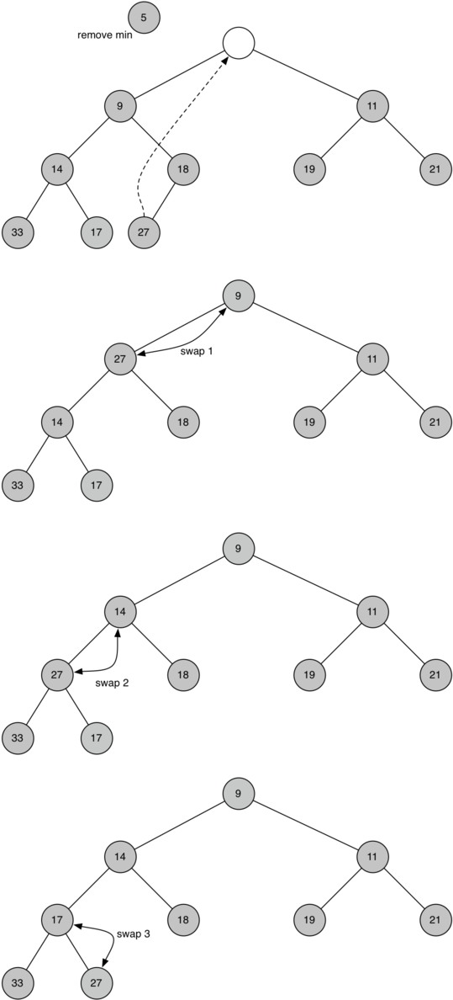

The Structure Property
----------------------

In order to make our heap work efficiently, we will take advantage of
the logarithmic nature of the binary tree to represent our heap. In
order to guarantee logarithmic performance, we must keep our tree
balanced. A balanced binary tree has roughly the same number of nodes in
the left and right subtrees of the root. In our heap implementation we
keep the tree balanced by creating a **complete binary tree**. A
complete binary tree is a tree in which each level has all of its nodes.
The exception to this is the bottom level of the tree, which we fill in
from left to right. This diagram shows an example of a
complete binary tree:


Another interesting property of a complete tree is that we can represent
it using a single list. We do not need to use nodes and references or
even lists of lists. Because the tree is complete, the left child of a
parent (at position $$p$$) is the node that is found in position $$2p$$ in
the list. Similarly, the right child of the parent is at position
$$2p + 1$$ in the list. To find the parent of any node in the tree, we can
simply use Python’s integer division. Given that a node is at position
$$n$$ in the list, the parent is at position $$n/2$$.
The diagram below shows a complete binary tree and also
gives the list representation of the tree. Note the $$2p$$ and $$2p+1$$
relationship between parent and children. The list representation of the
tree, along with the full structure property, allows us to efficiently
traverse a complete binary tree using only a few simple mathematical
operations. We will see that this also leads to an efficient
implementation of our binary heap.

The Heap Order Property
-----------------------

The method that we will use to store items in a heap relies on
maintaining the heap order property. The **heap order property** is as
follows: In a heap, for every node $$x$$ with parent $$p$$, the key in $$p$$
is smaller than or equal to the key in $$x$$.
The diagram below also illustrates a complete binary tree
that has the heap order property.


Heap Operations
---------------

We will begin our implementation of a binary heap with the constructor.
Since the entire binary heap can be represented by a single list, all
the constructor will do is initialize the list and an attribute
`current_size` to keep track of the current size of the heap.
The code below shows the Python code for the constructor.
You will notice that an empty binary heap has a single zero as the first
element of `heap_list` and that this zero is not used, but is there so
that simple integer division can be used in later methods.

```python
class BinHeap(object):
    def __init__(self):
        self.heap_list = [0]
        self.current_size = 0
```
The next method we will implement is `insert`. The easiest, and most
efficient, way to add an item to a list is to simply append the item to
the end of the list. The good news about appending is that it guarantees
that we will maintain the complete tree property. The bad news about
appending is that we will very likely violate the heap structure
property. However, it is possible to write a method that will allow us
to regain the heap structure property by comparing the newly added item
with its parent. If the newly added item is less than its parent, then
we can swap the item with its parent. The diagram below shows
the series of swaps needed to percolate the newly added item up to its
proper position in the tree.


Notice that when we percolate an item up, we are restoring the heap
property between the newly added item and the parent. We are also
preserving the heap property for any siblings. Of course, if the newly
added item is very small, we may still need to swap it up another level.
In fact, we may need to keep swapping until we get to the top of the
tree. The code below shows the `percolate_up` method, which
percolates a new item as far up in the tree as it needs to go to
maintain the heap property. Here is where our wasted element in
`heap_list` is important. Notice that we can compute the parent of any
node by using simple integer division. The parent of the current node
can be computed by dividing the index of the current node by 2.

```python
def percolate_up(self, i):
    while i // 2 > 0:
        if self.heap_list[i] < self.heap_list[i // 2]:
            tmp = self.heap_list[i // 2]
            self.heap_list[i // 2] = self.heap_list[i]
            self.heap_list[i] = tmp
        i = i // 2
```

We are now ready to write the `insert` method (see below). Most of the
work in the `insert` method
is really done by `percolate_up`. Once a new item is appended to the tree,
`percolate_up` takes over and positions the new item properly.

```python
def insert(self, k):
    self.heap_list.append(k)
    self.current_size = self.current_size + 1
    self.percolate_up(self.current_size)
```

With the `insert` method properly defined, we can now look at the
`delete_min` method. Since the heap property requires that the root of the
tree be the smallest item in the tree, finding the minimum item is easy.
The hard part of `delete_min` is restoring full compliance with the heap
structure and heap order properties after the root has been removed. We
can restore our heap in two steps. First, we will restore the root item
by taking the last item in the list and moving it to the root position.
Moving the last item maintains our heap structure property. However, we
have probably destroyed the heap order property of our binary heap.
Second, we will restore the heap order property by pushing the new root
node down the tree to its proper position.
The diagram shows the series of swaps needed to move
the new root node to its proper position in the heap.



In order to maintain the heap order property, all we need to do is swap
the root with its smallest child less than the root. After the initial
swap, we may repeat the swapping process with a node and its children
until the node is swapped into a position on the tree where it is
already less than both children. The code for percolating a node down
the tree is found in the `percolate_down` and `min_child` methods below.

```python
def percolate_down(self, i):
    while (i * 2) <= self.current_size:
        mc = self.min_child(i)
        if self.heap_list[i] > self.heap_list[mc]:
            tmp = self.heap_list[i]
            self.heap_list[i] = self.heap_list[mc]
            self.heap_list[mc] = tmp
        i = mc

def min_child(self,i):
    if i * 2 + 1 > self.current_size:
        return i * 2

    if self.heap_list[i * 2] < self.heap_list[i * 2 + 1]:
        return i * 2

    return i * 2 + 1
```

The code for the `delete_min` operation is below.
Note that once again the hard work is handled by a helper function, in
this case `percolate_down`.

```python
def delete_min(self):
    return_value = self.heap_list[1]
    self.heap_list[1] = self.heap_list[self.current_size]
    self.current_size = self.current_size - 1
    self.heap_list.pop()
    self.percolate_down(1)
    return return_value
```

To finish our discussion of binary heaps, we will look at a method to
build an entire heap from a list of keys. The first method you might
think of may be like the following. Given a list of keys, you could
easily build a heap by inserting each key one at a time. Since you are
starting with a list of one item, the list is sorted and you could use
binary search to find the right position to insert the next key at a
cost of approximately $$O(\log{n})$$ operations. However, remember that
inserting an item in the middle of the list may require $$O(n)$$
operations to shift the rest of the list over to make room for the new
key. Therefore, to insert $$n$$ keys into the heap would require a total
of $$O(n \log{n})$$ operations. However, if we start with an entire list
then we can build the whole heap in $$O(n)$$ operations.
The code below shows the code to build the entire heap.

```python
def build_heap(self, alist):
    i = len(alist) // 2
    self.current_size = len(alist)
    self.heap_list = [0] + alist[:]
    while (i > 0):
        self.percolate_down(i)
        i = i - 1
```

![Building a Heap from the List [9, 6, 5, 2, 3]](figures/build-heap.png)

Above we see the swaps that the `build_heap`
method makes as it moves the nodes in an initial tree of `[9, 6, 5, 2,
3]` into their proper positions. Although we start out in the middle of
the tree and work our way back toward the root, the `percolate_down` method
ensures that the largest child is always moved down the tree. Because
the heap is a complete binary tree, any nodes past the halfway point
will be leaves and therefore have no children. Notice that when `i==1`,
we are percolating down from the root of the tree, so this may require
multiple swaps. As you can see in the rightmost two trees of
above, first the 9 is moved out of the root
position, but after 9 is moved down one level in the tree, `percolate_down`
ensures that we check the next set of children farther down in the tree
to ensure that it is pushed as low as it can go. In this case it results
in a second swap with 3. Now that 9 has been moved to the lowest level
of the tree, no further swapping can be done. It is useful to compare
the list representation of this series of swaps as shown in
above with the tree representation.

```
i = 2  [0, 9, 5, 6, 2, 3]
i = 1  [0, 9, 2, 6, 5, 3]
i = 0  [0, 2, 3, 6, 5, 9]
```

The assertion that we can build the heap in $$O(n)$$ may seem a bit
mysterious at first, and a proof is beyond the scope of this book.
However, the key to understanding that you can build the heap in $$O(n)$$
is to remember that the $$\log{n}$$ factor is derived from the height of
the tree. For most of the work in `build_heap`, the tree is shorter than
$$\log{n}$$.
