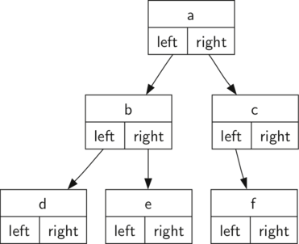

Our second method to represent a tree uses nodes and references. In this
case we will define a class that has attributes for the root value, as
well as the left and right subtrees. This is the more common representation in practice, so we will continue to use it for the remainder of the section.

Using nodes and references, we might think of the tree as being
structured like this:



We will start out with a simple class definition for the nodes and
references approach as shown below. The
important thing to remember about this representation is that the
attributes `left` and `right` will become references to other instances
of the `Node` class. For example, when we insert a new left child
into the tree we create another instance of `Node` and modify
`self.left` in the root to reference the new subtree.

```python
class Node(object):
    def __init__(self, val):
        self.val = val
        self.left = None
        self.right = None
```

Notice that the constructor function
expects to get some kind of value to store in the node. Just like you
can store any object you like in a list, the `val` attribute for a node can
be a reference to any object. For our early examples, we will store the
name of the node as the value. Using nodes and references to
represent the tree illustrated above, we would create six
instances of the Node class.

Next let’s look at function that can help us build the tree beyond the
root node. To add a left child to the tree, we will instantiate a new `Node` instace and pass it as `child` to the `insert_left` function defined here:

```python
def insert_left(self, child):
    if self.left is None:
        self.left = child
    else:
        child.left = self.left
        self.left = child
```

We must consider two cases for insertion. The first case is
characterized by a node with no existing left child. When there is no
left child, simply add a node to the tree. The second case is
characterized by a node with an existing left child. In the second case,
we insert a node and push the existing child down one level in the tree.

The code for `insert_right` must consider a symmetric set of cases. There
will either be no right child, or we must insert the node between the
root and an existing right child:

```python
def insert_right(self, child):
    if self.right is None:
        self.right = child
    else:
        child.right = self.right
        self.right = child
```

Now that we have all the pieces to create and manipulate a binary tree,
let’s use them to check on the structure a bit more. Let’s make a simple
tree with node a as the root, and add nodes b and c as children.
Below we create the tree and look at the
some of the values stored in `key`, `left`, and `right`. Notice that
both the left and right children of the root are themselves distinct
instances of the `Node` class. As we said in our original
recursive definition for a tree, this allows us to treat any child of a
binary tree as a binary tree itself.

```python
root = Node('a')
root.val  # => 'a'
root.left  # => None

root.insert_left(Node('b'))
root.left  # => <__main__.Node object>
root.left.val  # => 'b'

root.insert_right(Node('c'))
root.right  # => <__main__.Node object>
root.right.val  # => 'c'

root.right.val = 'hello'
root.right.val  # => 'hello'
```
