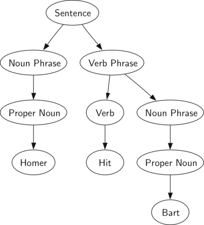
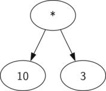
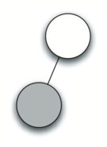
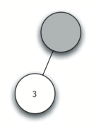
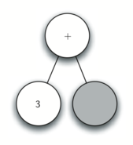
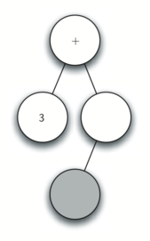
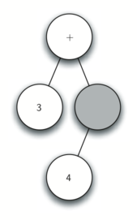
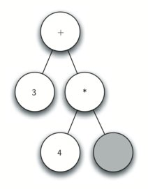
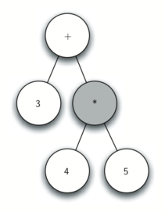

With the implementation of our tree data structure complete, we now look
at an example of how a tree can be used to solve some real problems. In
this section we will look at parse trees. Parse trees can be used to
represent real-world constructions like sentences or mathematical
expressions.

The diagram below shows the hierarchical structure of a
simple sentence. Representing a sentence as a tree structure allows us
to work with the individual parts of the sentence by using subtrees.

We can also represent a mathematical expression such as
$$((7 + 3) \times (5 - 2))$$ as a parse tree, as shown below.

We have already looked at fully
parenthesized expressions, so what do we know about this expression? We
know that multiplication has a higher precedence than either addition or
subtraction. Because of the parentheses, we know that before we can do
the multiplication we must evaluate the parenthesized addition and
subtraction expressions. The hierarchy of the tree helps us understand
the order of evaluation for the whole expression. Before we can evaluate
the top-level multiplication, we must evaluate the addition and the
subtraction in the subtrees. The addition, which is the left subtree,
evaluates to 10. The subtraction, which is the right subtree, evaluates
to 3. Using the hierarchical structure of trees, we can simply replace
an entire subtree with one node once we have evaluated the expressions
in the children. Applying this replacement procedure gives us the
simplified tree shown below.

In the rest of this section we are going to examine parse trees in more
detail. In particular we will look at how to build a parse tree from a fully parenthesized mathematical expression, and how hot evaluate the expression stored in a parse tree.

The first step in building a parse tree is to break up the expression
string into a list of tokens. There are four different kinds of tokens
to consider: left parentheses, right parentheses, operators, and
operands. We know that whenever we read a left parenthesis we are
starting a new expression, and hence we should create a new tree to
correspond to that expression. Conversely, whenever we read a right
parenthesis, we have finished an expression. We also know that operands
are going to be leaf nodes and children of their operators. Finally, we
know that every operator is going to have both a left and a right child.

Using the information from above we can define four rules as follows:

1.  If the current token is a `'('`, add a new node as the left child of
    the current node, and descend to the left child.
2.  If the current token is in the list `['+','-','/','*']`, set the
    root value of the current node to the operator represented by the
    current token. Add a new node as the right child of the current node
    and descend to the right child.
3.  If the current token is a number, set the root value of the current
    node to the number and return to the parent.
4.  If the current token is a `')'`, go to the parent of the
    current node.

Before writing the Python code, let’s look at an example of the rules
outlined above in action. We will use the expression $$(3 + (4 \times 5))$$. We
will parse this expression into the following list of character tokens
`['(', '3', '+', '(', '4', '*', '5' ,')',')']`. Initially we will
start out with a parse tree that consists of an empty root node.
The figures below illustrate the structure and contents
of the parse tree, as each new token is processed.

Using the above, let’s walk through the example
step by step:

1.  Create an empty tree.
2.  Read ( as the first token. By rule 1, create a new node as the left
    child of the root. Make the current node this new child.
3.  Read 3 as the next token. By rule 3, set the root value of the
    current node to 3 and go back up the tree to the parent.
4.  Read + as the next token. By rule 2, set the root value of the
    current node to + and add a new node as the right child. The new
    right child becomes the current node.
5.  Read a ( as the next token. By rule 1, create a new node as the left
    child of the current node. The new left child becomes the
    current node.
6.  Read a 4 as the next token. By rule 3, set the value of the current
    node to 4. Make the parent of 4 the current node.
7.  Read \* as the next token. By rule 2, set the root value of the
    current node to \* and create a new right child. The new right child
    becomes the current node.
8.  Read 5 as the next token. By rule 3, set the root value of the
    current node to 5. Make the parent of 5 the current node.
9.  Read ) as the next token. By rule 4 we make the parent of \* the
    current node.
10.  Read ) as the next token. By rule 4 we make the parent of + the
    current node. At this point there is no parent for + so we are done.

From the example above, it is clear that we need to keep track of the current
node as well as the parent of the current node. A simple solution to keeping
track of parents as we traverse the tree is to use a stack. Whenever we want
to descend to a child of the current node, we first push the current node on
the stack. When we want to return to the parent of the current node, we pop
the parent off the stack.

Using the rules described above, along with the stack and binary tree abstract
data types, we are now ready to write a Python function to create a parse
tree. The code for our parse tree builder is presented below.

<!-- litpy trees/parse_tree.py -->
