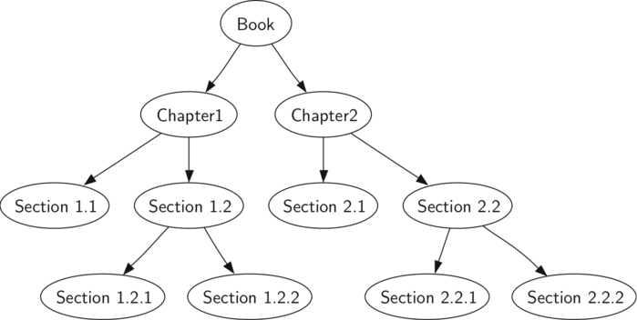

Now that we have examined the basic functionality of our tree data
structure, it is time to look at some additional usage patterns for
trees. These usage patterns can be divided into the three ways that we
access the nodes of the tree. There are three commonly used patterns to
visit all the nodes in a tree. The difference between these patterns is
the order in which each node is visited. We call this visitation of the
nodes a “traversal.” The three traversals we will look at are called
**preorder**, **inorder**, and **postorder**. Let’s start out by
defining these three traversals more carefully, then look at some
examples where these patterns are useful.

**preorder**: In a preorder traversal, we visit the root node first, then
recursively do a preorder traversal of the left subtree, followed by
a recursive preorder traversal of the right subtree.

**inorder**: In an inorder traversal, we recursively do an inorder traversal on
the left subtree, visit the root node, and finally do a recursive
inorder traversal of the right subtree.

**postorder**: In a postorder traversal, we recursively do a postorder traversal of
the left subtree and the right subtree followed by a visit to the
root node.

Let’s look at some examples that illustrate each of these three kinds of
traversals. First let’s look at the preorder traversal. As an example of
a tree to traverse, we will represent this book as a tree. The book is
the root of the tree, and each chapter is a child of the root. Each
section within a chapter is a child of the chapter, and each subsection
is a child of its section, and so on. The diagram below
shows a limited version of a book with only two chapters. Note that the
traversal algorithm works for trees with any number of children, but we
will stick with binary trees for now.



Suppose that you wanted to read this book from front to back. The
preorder traversal gives you exactly that ordering. Starting at the root
of the tree (the Book node) we will follow the preorder traversal
instructions. We recursively call `preorder` on the left child, in this
case Chapter1. We again recursively call `preorder` on the left child to
get to Section 1.1. Since Section 1.1 has no children, we do not make
any additional recursive calls. When we are finished with Section 1.1,
we move up the tree to Chapter 1. At this point we still need to visit
the right subtree of Chapter 1, which is Section 1.2. As before we visit
the left subtree, which brings us to Section 1.2.1, then we visit the
node for Section 1.2.2. With Section 1.2 finished, we return to Chapter
1. Then we return to the Book node and follow the same procedure for
Chapter 2.

The code for writing tree traversals is surprisingly elegant, largely
because the traversals are written recursively.
The code below is a simple Python implementation of a preorder
traversal of a binary tree. This approach is particularly elegant because our
base case is simply to check if the tree exists. If the tree parameter
is `None`, then the function returns without taking any action.


```python
def preorder(node):
    if node:
        print(node.val)
        preorder(node.left)
        preorder(node.right)
```

The algorithm for the `postorder` traversal, shown below, is nearly identical to `preorder`
except that we move the call to print to the end of the function.

```python
def postorder(node):
    if node:
        postorder(node.left)
        postorder(node.right)
        print(node.val)
```

We have already seen a common use for the postorder traversal, namely
evaluating a parse tree.
What we are doing is evaluating the left subtree, evaluating the right
subtree, and combining them in the root through the function call to an
operator. Assume that our binary tree is going to store only expression
tree data. Let’s rewrite the evaluation function, but model it even more
closely on the `postorder` code above.

```python
import operator

OPERATORS = {
    '+': operator.add,
    '-': operator.sub,
    '*': operator.mul,
    '/': operator.truediv
}

def postorder_eval(node):
    if node:
        left_result = postorder_eval(node.left)
        right_result = postorder_eval(node.right)
        if left_result and right_result:
            return OPERATORS[node.val](left_result, right_result)
        else:
            return node.val
```

Notice that the form of the above two functions is the same, except that instead of
printing the value at the end of the function, we return it. This allows
us to save the values returned from the recursive calls and use them as arguments
to the appropriate operator function.

The final traversal we will look at in this section is the inorder
traversal. In the inorder traversal we visit the left subtree, followed
by the root, and finally the right subtree.
Notice that in all three of the traversal functions we are
simply changing the position of the `print` statement with respect to
the two recursive function calls.

```python
def inorder(node):
    if node:
        inorder(node.left)
        print(node.val)
        inorder(node.right)
```

If we perform a simple inorder traversal of a parse tree we get our
original expression back, without any parentheses. Let’s modify the
basic inorder algorithm to allow us to recover the fully parenthesized
version of the expression. The only modifications we will make to the
basic template are as follows: print a left parenthesis *before* the
recursive call to the left subtree, and print a right parenthesis
*after* the recursive call to the right subtree. The modified code is
shown below.


```python
def print_exp(node):
    if node:
        return '({}{}{})'.format(
            print_exp(node.left),
            node.val,
            print_exp(node.right)
        )
    return ''
```

Notice that the `print_exp` function as we have implemented it puts
parentheses around each number. While not incorrect, the parentheses are
clearly not needed. Modifying the function to remove these redundant
parentheses is left as an exercise for the reader.
