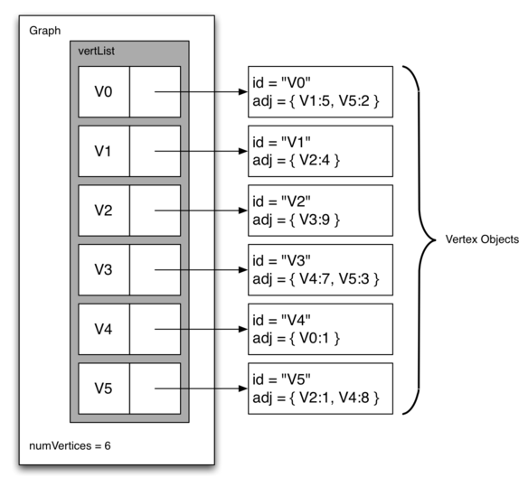

An Adjacency List
=================

A more space-efficient way to implement a sparsely connected graph is to
use the unfortunately named adjacency list structure. In an adjacency list implementation we keep a
master collection of all the vertices in the Graph object and then each vertex
object in the graph maintains a list of the other vertices that it is
connected to. In our implementation of the `Vertex` class we will use a
dictionary rather than a list as our master collection, where the dictionary keys are the
vertices, and the values are the weights. The diagram below shows an
adjacency list representation of the example graph we have been discussing.

The advantage of the adjacency list implementation is that it allows us
to compactly represent a sparse graph. The adjacency list also allows us
to easily find all the links that are directly connected to a particular
vertex.
