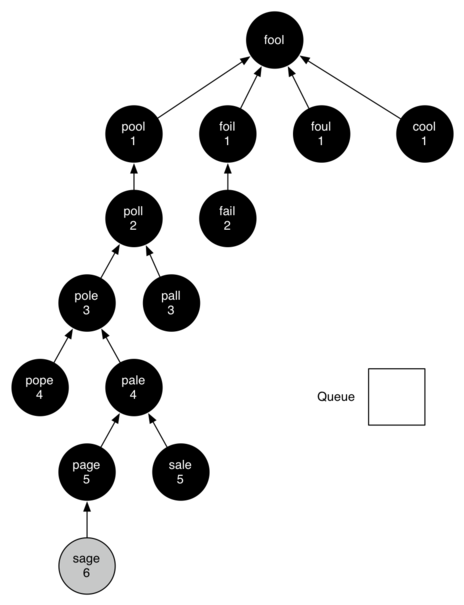

Implementing Breadth First Search
=================================

With the graph constructed we can now turn our attention to the
algorithm we will use to find the shortest solution to the word ladder
problem. The graph algorithm we are going to use is called the “breadth
first search” algorithm. **Breadth first search** (**BFS**) is one of
the easiest algorithms for searching a graph. It also serves as a
prototype for several other important graph algorithms that we will
study later.

Given a graph $$G$$ and a starting vertex $$s$$, a breadth first search
proceeds by exploring edges in the graph to find all the vertices in $$G$$
for which there is a path from $$s$$. The remarkable thing about a breadth
first search is that it finds *all* the vertices that are a distance $$k$$
from $$s$$ before it finds *any* vertices that are a distance $$k+1$$. One
good way to visualize what the breadth first search algorithm does is to
imagine that it is building a tree, one level of the tree at a time. A
breadth first search adds all children of the starting vertex before it
begins to discover any of the grandchildren.

The breadth first search algorithm shown in below uses the adjacency list graph
representation we developed earlier. In addition it uses a queue a
crucial point as we will see, to decide which vertex to explore next, and also to maintain a record of the depth to which we have traversed at any point.

BFS starts by initializing a set to retain a record of which vertices
have been visited already. Next, we initialize a queue (in this case utilizing
the deque type from Python’s `collections` module) with a tuple of the
starting vertex `start` and the depth to reach that vertex `0`. The next step
is to begin to systematically explore vertices at the front of the
queue. We explore each new node at the front of the queue by iterating
over its adjacency list. As each node on the adjacency list is examined
and its presence is checked in the `visited` set, if it has not been visited
then two things happen:

1.  The new, unvisited vertex is added to `visited`
2.  A tuple of the new, unvisited vertex and `depth + 1` is added to the
end of the queue. Adding the new vertex effectively schedules it for
further exploration, but not until all the other vertices on the
adjacency list have been explored. As we have progressed one step
further along the graph, we also increment our record of the depth
traveled to reach that vertex

```python
from collections import deque

def traverse(graph, start):
    visited = set()
    queue = deque([(start, 0)])
    while queue:
        vertex, depth = queue.popleft()
        yield vertex, depth
        for neighbor in graph.get_connections():
            if neighbor not in visited:
                visited.add(neighbor)
                queue.append((neighbor, depth + 1))

for vertex, depth in traverse(word_graph, fool_vertex):
    if vertex.key == 'sage':
        print 'reached target is {} steps'.format(depth)
```

Let’s look at how the `traverse` function would construct the breadth first
tree corresponding to the word ladder graph we considered previously.
Starting from fool we take all nodes that are adjacent to fool and add
them to the tree. The adjacent nodes include pool, foil, foul, and cool.
Each of these nodes are added to the queue of new nodes to expand.
The illustration below shows the state of the in-progress tree along
with the queue after this step.


In the next step `traverse` removes the next node (pool) from the front of
the queue and repeats the process for all of its adjacent nodes.
However, when `traverse` examines the node cool, it finds that it has already
been visited. This implies that there is a
shorter path to cool. The only new node added to the queue while examining pool is
poll. The new state of the tree and queue is shown below.


The next vertex on the queue is foil. The only new node that foil can
add to the tree is fail. As `traverse` continues to process the queue,
neither of the next two nodes add anything new to the queue or the tree.
The illustration below shows the tree and the queue after expanding
all the vertices on the second level of the tree.


You should continue to work through the algorithm on your own so that
you are comfortable with how it works. The illustration below
shows the final breadth first search tree after all the vertices have been expanded.


