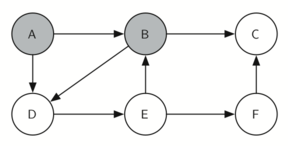
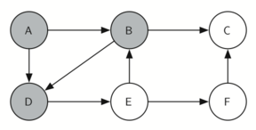
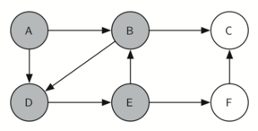
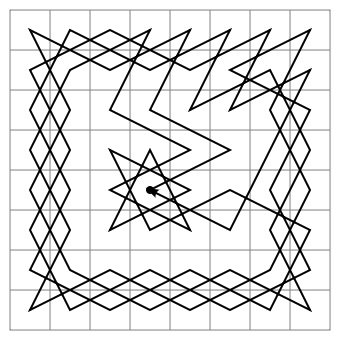

Implementing Knight’s Tour
==========================

The search algorithm we will use to solve the knight’s tour problem is
called **depth first search** (**DFS**). Whereas the breadth first
search algorithm discussed in the previous section builds a search tree
one level at a time, a depth first search creates a search tree by
exploring one branch of the tree as deeply as possible. In this section
we will look at two algorithms that implement a depth first search. The
first algorithm we will look at directly solves the knight’s tour
problem by explicitly forbidding a node to be visited more than once.
The second implementation is more general, but allows nodes to be
visited more than once as the tree is constructed. The second version is
used in subsequent sections to develop additional graph algorithms.

The depth first exploration of the graph is exactly what we need in
order to find a path that has exactly 63 edges. We will see that when
the depth first search algorithm finds a dead end (a place in the graph
where there are no more moves possible) it backs up the tree to the next
deepest vertex that allows it to make a legal move.

The `knight_tour` function takes four parameters: `n`, the current depth
in the search tree; `path`, a list of vertices visited up to this point;
`u`, the vertex in the graph we wish to explore; and `limit` the number
of nodes in the path. The `knight_tour` function is recursive. When the
`knight_tour` function is called, it first checks the base case
condition. If we have a path that contains 64 vertices, we return from
`knight_tour` with a status of `True`, indicating that we have found a
successful tour. If the path is not long enough we continue to explore
one level deeper by choosing a new vertex to explore and calling
`knight_tour` recursively for that vertex.

DFS also uses colors to keep track of which vertices in the graph have
been visited. Unvisited vertices are colored white, and visited vertices
are colored gray. If all neighbors of a particular vertex have been
explored and we have not yet reached our goal length of 64 vertices, we
have reached a dead end. When we reach a dead end we must backtrack.
Backtracking happens when we return from `knight_tour` with a status of
`False`. In the breadth first search we used a queue to keep track of
which vertex to visit next. Since depth first search is recursive, we
are implicitly using a stack to help us with our backtracking. When we
return from a call to `knight_tour` with a status of `False`, in line 11,
we remain inside the `while` loop and look at the next vertex in
`nbrList`.

**Listing 3**
```python

def knight_tour(n,path,u,limit):
    u.setColor('gray')
    path.append(u)
    if n < limit:
        nbrList = list(u.getConnections())
        i = 0
        done = False
        while i < len(nbrList) and not done:
            if nbrList[i].getColor() == 'white':
                done = knight_tour(n+1, path, nbrList[i], limit)
            i = i + 1
        if not done:  # prepare to backtrack
            path.pop()
            u.setColor('white')
    else:
        done = True
    return done
```

Let's look at a simple example of `knight_tour` in action. You can refer
to the figures below to follow the steps of the search. For this example
we will assume that the call to the `getConnections` method on line 6
orders the nodes in alphabetical order. We begin by calling
`knight_tour(0,path,A,6)`









It is remarkable that our choice of data structure and
algorithm has allowed us to straightforwardly solve a problem that
remained impervious to thoughtful mathematical investigation for
centuries.

With some modification, the algorithm can also be used to discover
one of a number of “closed” (circular) tours, which can therefore be
started at any square of the board:


