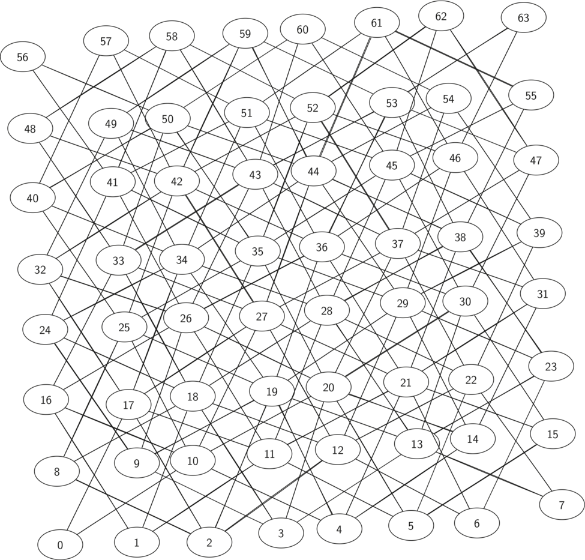
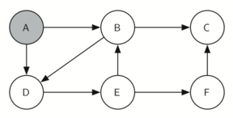
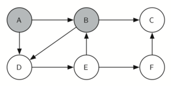
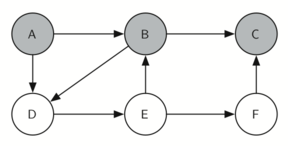
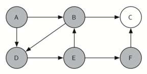
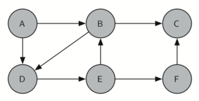
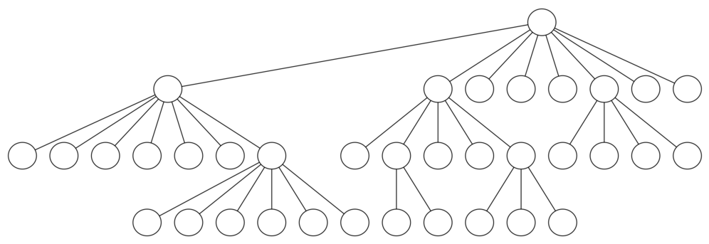
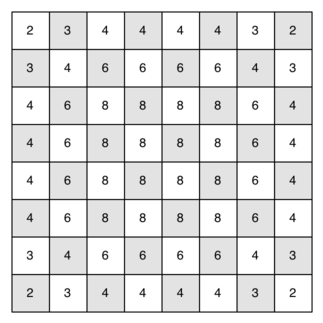
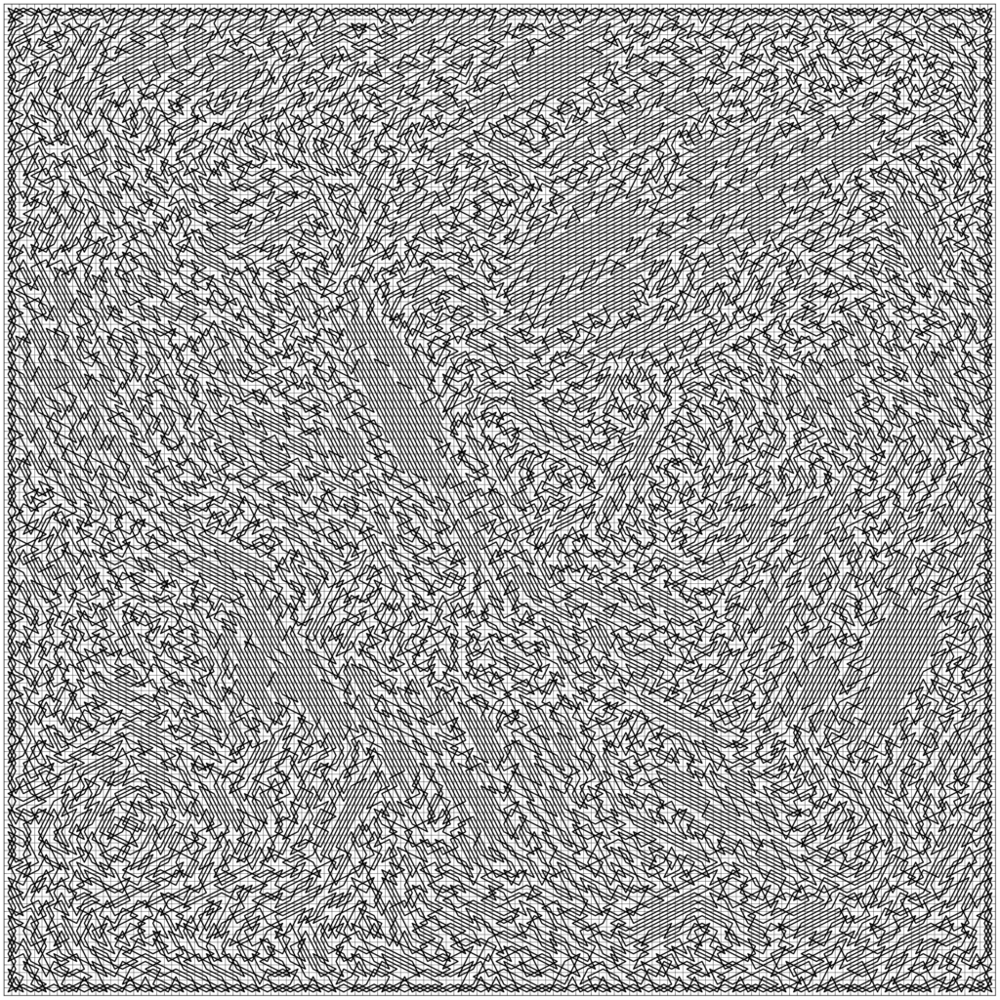

"""
The Knight’s Tour Problem
=========================

The “[knight’s tour](https://en.wikipedia.org/wiki/Knight%27s_tour)” is
a classic problem in graph theory, first posed over 1,000 years ago and
pondered by legendary mathematicians including Leonhard Euler before
finally being solved in 1823. We will use the knight's tour problem to
illustrate a second common graph algorithm called depth first search.

The knight’s tour puzzle is played on a chess board with a single chess
piece, the knight. The object of the puzzle is to find a sequence of
moves that allow the knight to visit every square on the board exactly
once, like so:

One such sequence is called a “tour.” The upper bound on the
number of possible legal tours for an eight-by-eight chessboard is known
to be $$1.305 \times 10^{35}$$; however, there are even more possible
dead ends. Clearly this is a problem that requires some real brains,
some real computing power, or both.

Once again we will solve the problem using two main steps:

-   Represent the legal moves of a knight on a chessboard as a graph.
-   Use a graph algorithm to find a path of length
    $$rows \times columns - 1$$ where every vertex on the graph is visited
    exactly once.

Building the Knight’s Tour Graph
---

To represent the knight’s tour problem as a graph we will use the
following two ideas: Each square on the chessboard can be represented as
a node in the graph.

To build the full graph for an n-by-n board we can use the Python
function shown below. The `build_knight_graph` function makes one pass
over the entire board. At each square on the board the
`build_knight_graph` function calls a helper, `generate_legal_moves`, to
create a list of legal moves for that position on the board. All legal
moves are then converted into edges in the graph.]
"""

from prior_section import Graph

def build_knight_graph(board_size):
    graph = Graph()
    for row in range(board_size):
        for col in range(board_size):
            for to_row, to_col in legal_moves_from(row, col, board_size):
                graph.add_edge((row, col), (to_row, to_col))
    return graph

"""
The `legal_moves_from` generator below takes the position of the
knight on the board and yields any of the eight possible moves that are still on the board.
"""

MOVE_OFFSETS = (
              (-1, -2), ( 1, -2),
    (-2, -1),                     ( 2, -1),
    (-2,  1),                     ( 2,  1),
              (-1,  2), ( 1,  2),
)

def legal_moves_from(row, col, board_size):
    for row_offset, col_offset in MOVE_OFFSETS:
        move_row, move_col = row + row_offset, col + col_offset
        if 0 <= move_row < board_size and 0 <= move_col < board_size:
            yield move_row, move_col

"""
The illustration below shows the complete graph of possible
moves on an eight-by-eight board. There are exactly 336 edges in the
graph. Notice that the vertices corresponding to the edges of the board
have fewer connections (legal moves) than the vertices in the middle of
the board. Once again we can see how sparse the graph is. If the graph
was fully connected there would be 4,096 edges. Since there are only 336
edges, the adjacency matrix would be only 8.2 percent full.

Implementing Knight’s Tour
---

The search algorithm we will use to solve the knight’s tour problem is
called **depth first search** (**DFS**). Whereas the breadth first
search algorithm discussed in the previous section builds a search tree
one level at a time, a depth first search creates a search tree by
exploring one branch of the tree as deeply as possible. In this section
we will look at two algorithms that implement a depth first search. The
first algorithm we will look at directly solves the knight’s tour
problem by explicitly forbidding a node to be visited more than once.
The second implementation is more general, but allows nodes to be
visited more than once as the tree is constructed. The second version is
used in subsequent sections to develop additional graph algorithms.

The depth first exploration of the graph is exactly what we need in
order to find a path that has exactly 63 edges. We will see that when
the depth first search algorithm finds a dead end (a place in the graph
where there are no more moves possible) it backs up the tree to the next
deepest vertex that allows it to make a legal move.

The `knight_tour` function takes four parameters: `n`, the current depth
in the search tree; `path`, a list of vertices visited up to this point;
`u`, the vertex in the graph we wish to explore; and `limit` the number
of nodes in the path. The `knight_tour` function is recursive. When the
`knight_tour` function is called, it first checks the base case
condition. If we have a path that contains 64 vertices, we return from
`knight_tour` with a status of `True`, indicating that we have found a
successful tour. If the path is not long enough we continue to explore
one level deeper by choosing a new vertex to explore and calling
`knight_tour` recursively for that vertex.

DFS also uses colors to keep track of which vertices in the graph have
been visited. Unvisited vertices are colored white, and visited vertices
are colored gray. If all neighbors of a particular vertex have been
explored and we have not yet reached our goal length of 64 vertices, we
have reached a dead end. When we reach a dead end we must backtrack.
Backtracking happens when we return from `knight_tour` with a status of
`False`. In the breadth first search we used a queue to keep track of
which vertex to visit next. Since depth first search is recursive, we
are implicitly using a stack to help us with our backtracking. When we
return from a call to `knight_tour` with a status of `False`, in line 11,
we remain inside the `while` loop and look at the next vertex in
`nbrList`.
"""

def knight_tour(n,path,u,limit):
    u.setColor('gray')
    path.append(u)
    if n < limit:
        nbrList = list(u.getConnections())
        i = 0
        done = False
        while i < len(nbrList) and not done:
            if nbrList[i].getColor() == 'white':
                done = knight_tour(n+1, path, nbrList[i], limit)
            i = i + 1
        if not done:  # prepare to backtrack
            path.pop()
            u.setColor('white')
    else:
        done = True
    return done

"""
Let's look at a simple example of `knight_tour` in action. You can refer
to the figures below to follow the steps of the search. For this example
we will assume that the call to the `getConnections` method on line 6
orders the nodes in alphabetical order. We begin by calling
`knight_tour(0,path,A,6)`

It is remarkable that our choice of data structure and
algorithm has allowed us to straightforwardly solve a problem that
remained impervious to thoughtful mathematical investigation for
centuries.

With some modification, the algorithm can also be used to discover
one of a number of “closed” (circular) tours, which can therefore be
started at any square of the board:

Knight’s Tour Analysis
---

There is one last interesting topic regarding the knight’s tour problem,
then we will move on to the general version of the depth first search.
The topic is performance. In particular, `knight_tour` is very sensitive
to the method you use to select the next vertex to visit. For example,
on a five-by-five board you can produce a path in about 1.5 seconds on a
reasonably fast computer. But what happens if you try an eight-by-eight
board? In this case, depending on the speed of your computer, you may
have to wait up to a half hour to get the results! The reason for this
is that the knight’s tour problem as we have implemented it so far is an
exponential algorithm of size $$O(k^N)$$, where N is the number of squares
on the chess board, and k is a small constant.
The diagram below can help us visualize why this is so.

The
root of the tree represents the starting point of the search. From there
the algorithm generates and checks each of the possible moves the knight
can make. As we have noted before the number of moves possible depends
on the position of the knight on the board. In the corners there are
only two legal moves, on the squares adjacent to the corners there are
three and in the middle of the board there are eight.
The diagram below shows the number of moves possible for
each position on a board. At the next level of the tree there are once
again between 2 and 8 possible next moves from the position we are
currently exploring. The number of possible positions to examine
corresponds to the number of nodes in the search tree.

We have already seen that the number of nodes in a binary tree of height
N is $$2^{N+1}-1$$. For a tree with nodes that may have up to eight
children instead of two the number of nodes is much larger. Because the
branching factor of each node is variable, we could estimate the number
of nodes using an average branching factor. The important thing to note
is that this algorithm is exponential: $$k^{N+1}-1$$, where $$k$$ is the
average branching factor for the board. Let’s look at how rapidly this
grows! For a board that is 5x5 the tree will be 25 levels deep, or N =
24 counting the first level as level 0. The average branching factor is
$$k = 3.8$$ So the number of nodes in the search tree is $$3.8^{25}-1$$ or
$$3.12 \times 10^{14}$$. For a 6x6 board, $$k = 4.4$$, there are $$1.5
\times 10^{23}$$ nodes, and for a regular 8x8 chess board, $$k = 5.25$$,
there are $$1.3 \times 10^{46}$$. Of course, since there are multiple
solutions to the problem we won’t have to explore every single node, but
the fractional part of the nodes we do have to explore is just a
constant multiplier which does not change the exponential nature of the
problem. We will leave it as an exercise for you to see if you can
express $$k$$ as a function of the board size.

Luckily there is a way to speed up the eight-by-eight case so that it
runs in under one second. In the listing below we show the code that
speeds up the `knight_tour`. This function (see
below), called `order_by_available` will be used in
place of the call to `u.getConnections` in the code previously shown
above. The critical line in the `order_by_available` function is line 10. This
line ensures that we select the vertex to go next that has the fewest
available moves. You might think this is really counter productive; why
not select the node that has the most available moves? You can try that
approach easily by running the program yourself and inserting the line
`resList.reverse()` right after the sort.

The problem with using the vertex with the most available moves as your
next vertex on the path is that it tends to have the knight visit the
middle squares early on in the tour. When this happens it is easy for
the knight to get stranded on one side of the board where it cannot
reach unvisited squares on the other side of the board. On the other
hand, visiting the squares with the fewest available moves first pushes
the knight to visit the squares around the edges of the board first.
This ensures that the knight will visit the hard-to-reach corners early
and can use the middle squares to hop across the board only when
necessary. Utilizing this kind of knowledge to speed up an algorithm is
called a heuristic. Humans use heuristics every day to help make
decisions, heuristic searches are often used in the field of artificial
intelligence. This particular heuristic is called Warnsdorff’s
algorithm, named after H. C. Warnsdorff who published his idea in 1823.
"""

def order_by_available(n):
    resList = []
    for v in n.getConnections():
        if v.getColor() == 'white':
            c = 0
            for w in v.getConnections():
                if w.getColor() == 'white':
                    c = c + 1
            resList.append((c, v))
    resList.sort(key=lambda x: x[0])
    return [y[1] for y in resList]

"""
For fun, here is a very large ($$130 \times 130$$) open knight's
tour created using Warnsdorf‘s rule:

"""
