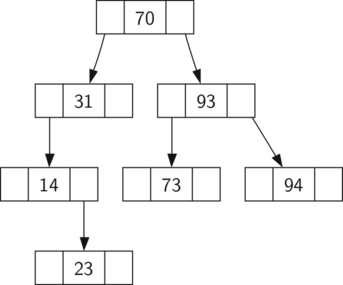
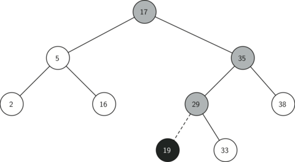
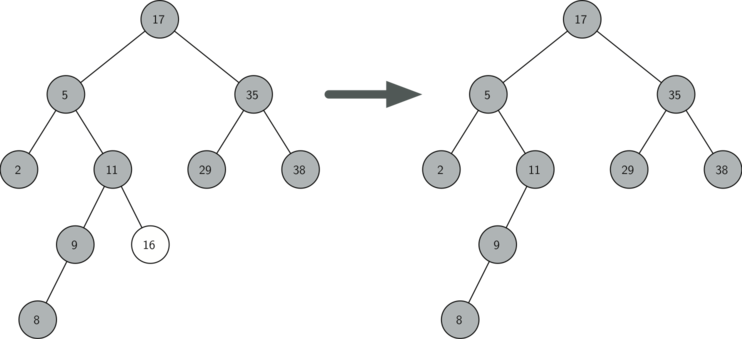
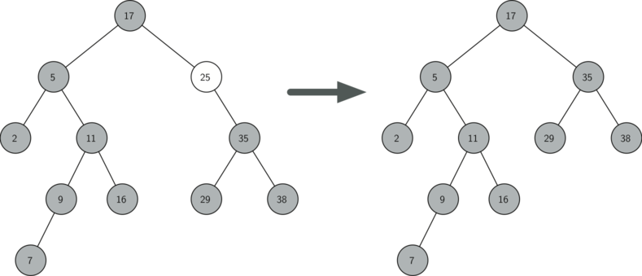
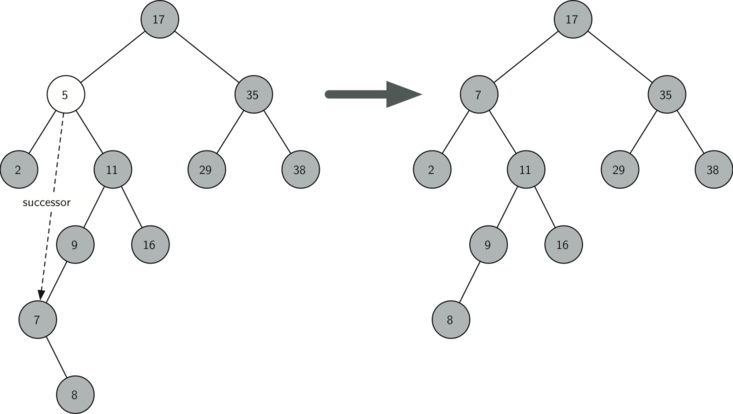

Search Tree Implementation
==========================

A binary search tree relies on the property that keys that are less than
the parent are found in the left subtree, and keys that are greater than
the parent are found in the right subtree. We will call this the **bst
property**. As we implement the Map interface as described above, the
bst property will guide our implementation.
The diagram below illustrates this property of a binary
search tree, showing the keys without any associated values. Notice that
the property holds for each parent and child. All of the keys in the
left subtree are less than the key in the root. All of the keys in the
right subtree are greater than the root.



Now that you know what a binary search tree is, we will look at how a
binary search tree is constructed. The search tree above represents the nodes that exist after we
have inserted the following keys in the order shown:
$$70, 31, 93, 94, 14, 23, 73$$. Since 70 was the first key inserted into the
tree, it is the root. Next, 31 is less than 70, so it becomes the left
child of 70. Next, 93 is greater than 70, so it becomes the right child
of 70. Now we have two levels of the tree filled, so the next key is
going to be the left or right child of either 31 or 93. Since 94 is
greater than 70 and 93, it becomes the right child of 93. Similarly 14
is less than 70 and 31, so it becomes the left child of 31. 23 is also
less than 31, so it must be in the left subtree of 31. However, it is
greater than 14, so it becomes the right child of 14.

To implement the binary search tree, we will use the nodes and
references approach similar to the one we used to implement the linked
list, and the expression tree. However, because we must be able create
and work with a binary search tree that is empty, our implementation
will use two classes. The first class we will call `BinarySearchTree`,
and the second class we will call `TreeNode`. The `BinarySearchTree`
class has a reference to the `TreeNode` that is the root of the binary
search tree. In most cases the external methods defined in the outer
class simply check to see if the tree is empty. If there are nodes in
the tree, the request is just passed on to a private method defined in
the `BinarySearchTree` class that takes the root as a parameter. In the
case where the tree is empty or we want to delete the key at the root of
the tree, we must take special action. The code for the
`BinarySearchTree` class constructor along with a few other
miscellaneous functions is shown below.

```python
class BinarySearchTree(object):

    def __init__(self):
        self.root = None
        self.size = 0

    def __len__(self):
        return self.size

    def __iter__(self):
        return self.root.__iter__()
```

The `TreeNode` class provides many helper functions that make the work
done in the `BinarySearchTree` class methods much easier. The
constructor for a `TreeNode`, along with these helper functions, is
shown below. As you can see, many
of these helper functions help to classify a node according to its own
position as a child, (left or right) and the kind of children the node
has. The `TreeNode` class will also explicitly keep track of the parent
as an attribute of each node. You will see why this is important when we
discuss the implementation for the `del` operator.

Another interesting aspect of the implementation of `TreeNode` below is that we use Python’s optional parameters.
Optional parameters make it easy for us to create a `TreeNode` under
several different circumstances. Sometimes we will want to construct a
new `TreeNode` that already has both a `parent` and a `child`. With an
existing parent and child, we can pass parent and child as parameters.
At other times we will just create a `TreeNode` with the key value pair,
and we will not pass any parameters for `parent` or `child`. In this
case, the default values of the optional parameters are used.


```python
class TreeNode(object):

    def __init__(self, key, val, left=None, right=None, parent=None):
        self.key = key
        self.val = val
        self.left = left
        self.right = right
        self.parent = parent

    def is_left_child(self):
        return self.parent and self.parent.left == self

    def is_right_child(self):
        return self.parent and self.parent.right == self

    def is_leaf(self):
        return not (self.right or self.left)

    def has_any_children(self):
        return self.right or self.left

    def has_both_children(self):
        return self.right and self.left

    def replace_node_data(self, key, val, left, right):
        self.key = key
        self.val = val
        self.left = left
        self.right = right
        if self.left:
            self.left.parent = self
        if self.right:
            self.right.parent = self
```

Now that we have the `BinarySearchTree` shell and the `TreeNode` it is
time to write the `put` method that will allow us to build our binary
search tree. The `put` method is a method of the `BinarySearchTree`
class. This method will check to see if the tree already has a root. If
there is not a root then `put` will create a new `TreeNode` and install
it as the root of the tree. If a root node is already in place then
`put` calls the private, recursive, helper function `_put` to search the
tree according to the following algorithm:

-   Starting at the root of the tree, search the binary tree comparing
    the new key to the key in the current node. If the new key is less
    than the current node, search the left subtree. If the new key is
    greater than the current node, search the right subtree.
-   When there is no left (or right) child to search, we have found the
    position in the tree where the new node should be installed.
-   To add a node to the tree, create a new `TreeNode` object and insert
    the object at the point discovered in the previous step.

The code below shows the Python code for inserting a new
node in the tree. The `_put` function is written recursively following
the steps outlined above. Notice that when a new child is inserted into
the tree, the `node` is passed to the new tree as the parent.

One important problem with our implementation of insert is that
duplicate keys are not handled properly. As our tree is implemented a
duplicate key will create a new node with the same key value in the
right subtree of the node having the original key. The result of this is
that the node with the new key will never be found during a search. A
better way to handle the insertion of a duplicate key is for the value
associated with the new key to replace the old value. We leave fixing
this bug as an exercise for you.


```python
def put(self, key, val):
    if self.root:
        self._put(key, val, self.root)
    else:
        self.root = TreeNode(key, val)
    self.size = self.size + 1

def _put(self, key, val, node):
    if key < node.key:
        if node.left:
           self._put(key, val, node.left)
        else:
           node.left = TreeNode(key, val, parent=node)
    else:
        if node.right:
           self._put(key, val, node.right)
        else:
           node.right = TreeNode(key, val, parent=node)
```

With the `put` method defined, we can easily overload the `[]` operator
for assignment by having the `__setitem__` method call (see below) the put method.
This allows us to write
Python statements like `my_zip_tree['Plymouth'] = 55446`, just like a
Python dictionary.

```python
def __setitem__(self, key, val):
    self.put(key, val)
```

The diagram below illustrates the process for inserting a new
node into a binary search tree. The lightly shaded nodes indicate the
nodes that were visited during the insertion process.



Once the tree is constructed, the next task is to implement the
retrieval of a value for a given key. The `get` method is even easier
than the `put` method because it simply searches the tree recursively
until it gets to a non-matching leaf node or finds a matching key. When
a matching key is found, the value stored in the val of the node is
returned.

The code below shows the code for `get`, `_get` and
`__getitem__`. The search code in the `_get` method uses the same logic
for choosing the left or right child as the `_put` method. Notice that
the `_get` method returns a `TreeNode` to `get`, this allows `_get` to
be used as a flexible helper method for other `BinarySearchTree` methods
that may need to make use of other data from the `TreeNode` besides the
val.

By implementing the `__getitem__` method we can write a Python statement
that looks just like we are accessing a dictionary, when in fact we are
using a binary search tree, for example `z = my_zip_tree['Fargo']`. As you
can see, all the `__getitem__` method does is call `get`.

```python
  def get(self, key):
      if self.root:
          result = self._get(key, self.root)
          return result and result.val or None
      return None

  def _get(self,key,node):
      if not node:
          return None
      if node.key == key:
          return node
      if key < node.key:
          return self._get(key, node.left)
      return self._get(key, node.right)

  def __getitem__(self, key):
      return self.get(key)
```

Using `get`, we can implement the `in` operation by writing a
`__contains__` method for the `BinarySearchTree`. The `__contains__`
method will simply call `get` and return `True` if `get` returns a
value, or `False` if it returns `None`. The code for `__contains__` is
shown below.

```python
def __contains__(self, key):
    return bool(self._get(key, self.root))
```

Recall that `__contains__` overloads the `in` operator and allows us to
write statements such as:

```python
if 'Northfield' in my_zip_tree:
    print('oom ya ya')
```

Finally, we turn our attention to the most challenging method in the
binary search tree, the deletion of a key (see below). The first task is to find the node to
delete by searching the tree. If the tree has more than one node we
search using the `_get` method to find the `TreeNode` that needs to be
removed. If the tree only has a single node, that means we are removing
the root of the tree, but we still must check to make sure the key of
the root matches the key that is to be deleted. In either case if the
key is not found the `del` operator raises an error.

```python
def delete(self,key):
    if self.size > 1:
        node_to_remove = self._get(key,self.root)
        if node_to_remove:
            self.remove(node_to_remove)
            self.size = self.size-1
        else:
            raise KeyError('Error, key not in tree')
    elif self.size == 1 and self.root.key == key:
        self.root = None
        self.size = self.size - 1
    else:
        raise KeyError('Error, key not in tree')

def __delitem__(self,key):
    self.delete(key)
```

Once we’ve found the node containing the key we want to delete, there
are three cases that we must consider:

1.  The node to be deleted has no children
2.  The node to be deleted has only one child
3.  The node to be deleted has two children

The first case is straightforward. If
the current node has no children all we need to do is delete the node
and remove the reference to this node in the parent. The code for this
case is shown below.

```python
    if node.is_leaf():
        if node == node.parent.left:
            node.parent.left = None
        else:
            node.parent.right = None
```


The second case is only slightly more complicated (see below). If a node
has only a single child, then we can simply promote the child to take
the place of its parent. The code for this case is shown in the next
code sample. As you look at this code you will see that there are six
cases to consider. Since the cases are symmetric with respect to either
having a left or right child we will just discuss the case where the
current node has a left child. The decision proceeds as follows:

1.  If the current node is a left child then we only need to update the
    parent reference of the left child to point to the parent of the
    current node, and then update the left child reference of the parent
    to point to the current node’s left child.
2.  If the current node is a right child then we only need to update the
    parent reference of the right child to point to the parent of the
    current node, and then update the right child reference of the
    parent to point to the current node’s right child.
3.  If the current node has no parent, it must be the root. In this case
    we will just replace the `key`, `val`, `left`, and
    `right` data by calling the `replace_node_data` method on
    the root.

```python
    else: # this node has one child
       if node.left:
          if node.is_left_child():
              node.left.parent = node.parent
              node.parent.left = node.left
          elif node.is_right_child():
              node.left.parent = node.parent
              node.parent.right = node.left
          else:
              node.replace_node_data(
                  node.left.key,
                  node.left.val,
                  node.left.left,
                  node.left.right
              )
       else:
          if node.is_left_child():
              node.right.parent = node.parent
              node.parent.left = node.right
          elif node.is_right_child():
              node.right.parent = node.parent
              node.parent.right = node.right
          else:
              node.replace_node_data(
                  node.right.key,
                  node.right.val,
                  node.right.left,
                  node.right.right
              )
```


The third case is the most difficult case to handle (see below). If a node has two children, then it is
unlikely that we can simply promote one of them to take the node’s
place. We can, however, search the tree for a node that can be used to
replace the one scheduled for deletion. What we need is a node that will
preserve the binary search tree relationships for both of the existing
left and right subtrees. The node that will do this is the node that has
the next-largest key in the tree. We call this node the **successor**,
and we will look at a way to find the successor shortly. The successor
is guaranteed to have no more than one child, so we know how to remove
it using the two cases for deletion that we have already implemented.
Once the successor has been removed, we simply put it in the tree in
place of the node to be deleted.



The code to handle the third case is shown below. Notice
that we make use of the helper methods `find_successor` and `find_min` to
find the successor. To remove the successor, we make use of the method
`splice_out`. The reason we use `splice_out` is that it goes directly to
the node we want to splice out and makes the right changes. We could
call `delete` recursively, but then we would waste time re-searching for
the key node.

```python
    elif node.has_both_children(): #interior
        successor = node.find_successor()
        successor.splice_out()
        node.key = successor.key
        node.val = successor.val
```

The code to find the successor is shown below and as you can see is a method of the
`TreeNode` class. This code makes use of the same properties of binary
search trees that cause an inorder traversal to print out the nodes in
the tree from smallest to largest. There are three cases to consider
when looking for the successor:

1.  If the node has a right child, then the successor is the smallest
    key in the right subtree.
2.  If the node has no right child and is the left child of its parent,
    then the parent is the successor.
3.  If the node is the right child of its parent, and itself has no
    right child, then the successor to this node is the successor of its
    parent, excluding this node.

The first condition is the only one that matters for us when deleting a
node from a binary search tree. However, the `find_successor` method has
other uses that we will explore in the exercises at the end of this
section.

The `find_min` method is called to find the minimum key in a subtree. You
should convince yourself that the minimum valued key in any binary
search tree is the leftmost child of the tree. Therefore the `find_min`
method simply follows the `left` references in each node of the
subtree until it reaches a node that does not have a left child.

```python
def find_successor(self):
    succ = None
    if self.right:
        succ = self.right.find_min()
    else:
        if self.parent:
            if self.is_left_child():
                succ = self.parent
            else:
                self.parent.right = None
                succ = self.parent.find_successor()
                self.parent.right = self
    return succ

def find_min(self):
    current = self
    while current.left:
        current = current.left
    return current

def splice_out(self):
    if self.is_leaf():
        if self.is_left_child():
            self.parent.left = None
        else:
            self.parent.right = None
    elif self.has_any_children():
        if self.left:
            if self.is_left_child():
                self.parent.left = self.left
            else:
                self.parent.right = self.left
            self.left.parent = self.parent
        else:
            if self.is_left_child():
                self.parent.left = self.right
            else:
                self.parent.right = self.right
            self.right.parent = self.parent
```

We need to look at one last interface method for the binary search tree.
Suppose that we would like to simply iterate over all the keys in the
tree in order. You already know how to traverse a
binary tree in order, using the `inorder` traversal algorithm. However,
writing an iterator requires a bit more work, since an iterator should
return only one node each time the iterator is called.

Python provides us with a very powerful function to use when creating an
iterator. The function is called `yield`. `yield` is similar to `return`
in that it returns a value to the caller. However, `yield` also takes
the additional step of freezing the state of the function so that the
next time the function is called it continues executing from the exact
point it left off earlier. Functions that create objects that can be
iterated are called generator functions.

The code for an `inorder` iterator of a binary tree is shown below. Look at this code carefully; at first glance you might think
that the code is not recursive. However, remember that `__iter__`
overrides the `for x in` operation for iteration, so it really is
recursive! Because it is recursive over `TreeNode` instances the
`__iter__` method is defined in the `TreeNode` class.

```python
def __iter__(self):
    if self:
        if self.left:
            for elem in self.left:
                yield elem
        yield self.key
        if self.right:
            for elem in self.right:
                yield elem
```
